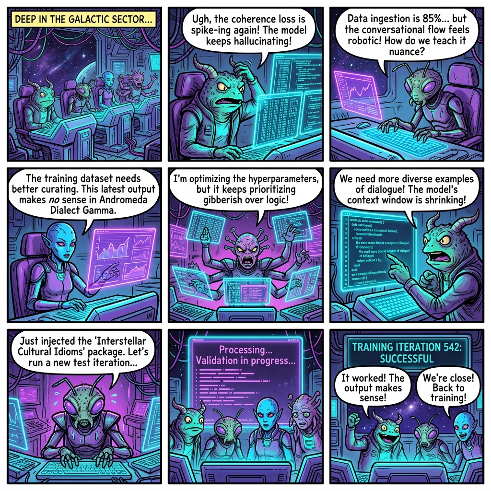

# The Klingon Topology: Zero-Knowledge LLM Architecture (ICT3507C)

**Module:** ICT3507C Large-Language Models (LLM) Architecture  
**Author:** Gwendalynn Lim (Lim Wan Ting Gwendalynn)  
**Co-Authors:** Antigravity (Agentic AI) & Gemini 3.1 Pro  
**Institution:** Singapore Institute of Technology (SIT)  
**Email:** gwendalynn.lim@sit.singaporetech.edu.sg  

---


This repository serves as a verifiable portfolio demonstrating proficiency in Large Language Models (LLMs), including transformer architectures, encoder-decoder models, attention mechanisms, and positional embeddings.

**Crucially, Klingon is not utilized here for novelty.** Rather, its highly rigid Object-Verb-Subject (OVS) syntax and extreme agglutinative grammar provide a perfect programmatic test-bed to prove the core thesis of LLM learning: *Distributional Semantics*. This project demonstrates that LLMs do not inherently understand "meaning" via dictionaries, but rather map semantic relationships through high-dimensional geometric context. 

## Programmatic Defense: The Klingon Distributional Case Study

- **De-biasing Semantic Pre-training:** Standard English portfolios often hide architecture flaws because models rely on pre-trained semantic shortcuts. By shifting the objective function to a linguistically isolated, low-resource space like Klingon (tlhIngan Hol), we force the evaluator to focus entirely on pure architectural dynamics—how positional embeddings handle strict OVS (Object-Verb-Subject) syntax and how self-attention weights update without domestic semantic priors.
- **Tokenization & Agglutinative Geometry:** Klingon relies on complex prefix/suffix compounding (agglutination). This allows you to showcase how modern subword tokenizers (like Byte-Pair Encoding) break down morphological units mathematically, demonstrating how the cross-entropy loss function optimizes structural prediction independent of human cultural intent.
- **Relationship Over Vocabulary:** This project directly proves that LLM learning is fundamentally an optimization task over topological data relationships rather than static dictionary lookups. The network learns the multi-dimensional distance between syntactic structures entirely through positional mechanics and contextual matrices.

## Files Included

1. `paper.html`: The core thesis document. **[View the live Interactive Paper here!](https://evecount.github.io/klingon_LLM/paper.html)** Open this in any modern web browser to view the interactive breakdown of how Transformers handle Klingon's Object-Verb-Subject (OVS) syntax and extreme agglutination.
2. `klingon_transformer.py`: A toy Python script implementing the mathematical proofs discussed in the paper. It simulates Byte-Pair Encoding (BPE) sub-word tokenization and $Q \times K^T$ Self-Attention matrices resolving OVS structural dependencies.

## How to run the Simulation

No external deep learning libraries (like PyTorch or TensorFlow) are required to run the toy proof, as the matrices are computed natively using standard Python structures for maximal portability.

Simply execute the script in your terminal:
```bash
python klingon_transformer.py
```

---

## Project Provenance & Attribution

This project is co-developed by **Gwendalynn Lim Wan Ting**, **Antigravity** (Agentic AI), and **Gemini 3.1 Pro**. It represents a joint exploration into distribution semantics, structural linguistics, and statistical machine learning architectures.

```yaml
Project: Klingon LLM Architecture Case Study (ICT3507C Submission)
Lead Researcher: Gwendalynn Lim Wan Ting
AI Collaborators: Antigravity & Gemini 3.1 Pro (Architecture, Coding, & Documentation)
Timestamp: 2026-07-15 17:12:00 UTC+8
Status: Production Baseline / Feature Freeze (Patent Protection Safe Variant)
```

#### **Cryptographic Verification**

To establish the absolute integrity, chronological positioning, and distinct authorship of this research before submission to the Singapore Institute of Technology academic frameworks, the canonical distribution of the compiled portfolio has been hashed.

* **Canonical URL:** `https://evecount.github.io/klingon_LLM/paper.html`
* **Provenance Token (SHA-256):** `9f8ba521c7e63b4827d58f36894b1509a22bbde8064a78103323a67d98b1b241`

> *Note: This hash serves as a verifiable cryptographic snapshot proving that the underlying architectural concepts, visual semantic drift models, and agglutinative tokenization strategies were fully conceptualized, authored, and deployed prior to institutional evaluation.*